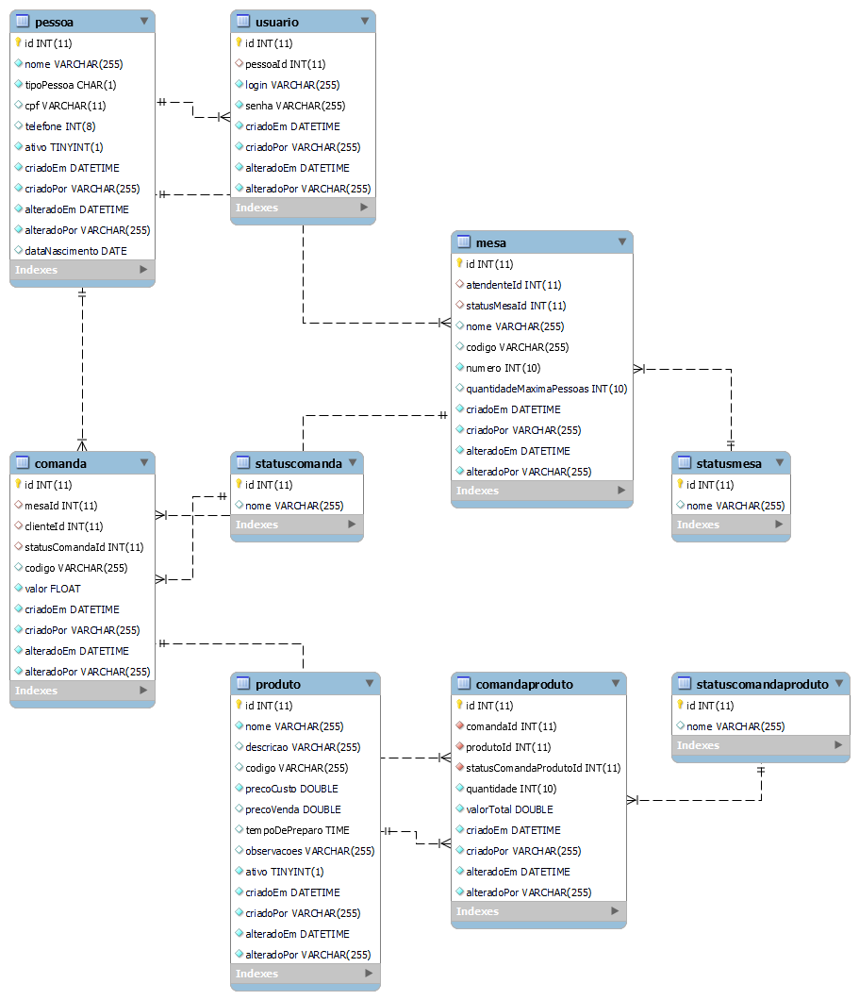
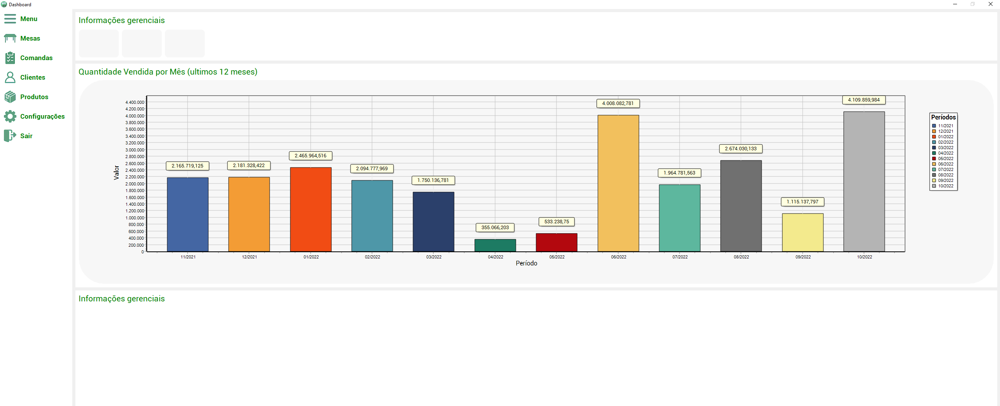

# Ravin

Projeto modelo para os alunos do curso Dev2Blu

## Projeto

O projeto desenvolvido nesse curso é um sistema para gestão de mesas de restaurante. O sistema contará com uma aplicação desktop para controle de das mesas e comandas que será usado pela frente de caixa e também com um app para a realização dos pedidos

### Entidades

* StatusMesa
  * Id;
  * Nome;
 

* StatusComanda
  * Id
  * Nome
 

* StatusComandaProduto
  * Id
  * Nome
 

* Pessoa
  * Id;
  * Nome;
  * TipoPessoa;
  * Cpf;
  * Telefone;
  * Ativo;
  * DataNascimento;
  * CriadoEm;
  * CriadoPor;
  * AlteradoEm;
  * AlteradoPor;
 

* Mesa
  * Id;
  * AtendenteId;
  * StatusMesaId;
  * Nome;
  * Codigo;
  * Numero;
  * QuantidadeMaximaPessoas;
  * CriadoEm;
  * CriadoPor;
  * AlteradoEm;
  * AlteradoPor;
 

* Comanda
  * Id;
  * MesaId;
  * ClienteId;
  * StatusComandaId;
  * Codigo;
  * Valor;
  * CriadoEm;
  * CriadoPor;
  * AlteradoEm;
  * AlteradoPor;
 

* Produto
  * Id;
  * Nome;
  * Descricao;
  * Codigo;
  * PrecoCusto;
  * PrecoVenda;
  * TempoDePreparo;
  * Observacoes;
  * Ativo;
  * CriadoEm;
  * CriadoPor;
  * AlteradoEm;
  * AlteradoPor;
 

* ComandaProduto
  * Id;
  * ComandaId;
  * ProdutoId;
  * StatusComandaProdutoId;
  * Codigo;
  * Quantidade;
  * ValorTotal;
  * CriadoEm;
  * CriadoPor;
  * AlteradoEm;
  * AlteradoPor;

## MER - Modelo Entidade Relacionamento

 
 

## Protótipo de telas

### Dashboard

 
 

### Detalhes mesa

 
 

#### Cadastro de produto

 
 

#### Cadastro de Comanda

 
 

#### Cadastro de Comanda

 
 

## Precisa ser inplementado

## Validações

### Cadastro de Mesa

* Antes de mudar o status de uma mesa de ocupada para livre é necessário se não há comandas vinculada a mesa;
* Antes de reservar uma mesa verificar se não há nenhuma comanda vinculada a mesa;
* Validar se a quantidade máxima de pessoas da mesa não está negativa;
* Antes de excluir uma mesa verificar se não existe alguma comanda vinculada a ela;
* Inserir os dados de auditoria;

### Cadastro de Produto

* Validar se o preço de custo não é negativo;
* Validar se o preço de venda não é negativo;
* Validar se o preço de custo não é maior que o preço de venda;
* Inserir os dados de auditoria;

### Cadastro de Comanda

* Antes de mudar uma comanda de em aberto para paga é necessário validar se não há nenhum produto de comanda em aberto;
* Bloquear a insersão de novos produtos quando uma comanda estiver fechada;

## Novas funcionalidades

* Calular o valor total da comanda com base a inserção de novos produtos na comanda;
* Calcular o valor total de um item da comanda com base na quantidade de itens daquele tipo que foram consumidos;
* Tela de configurações;